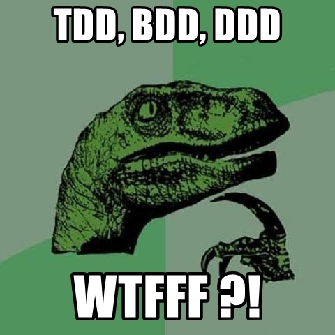
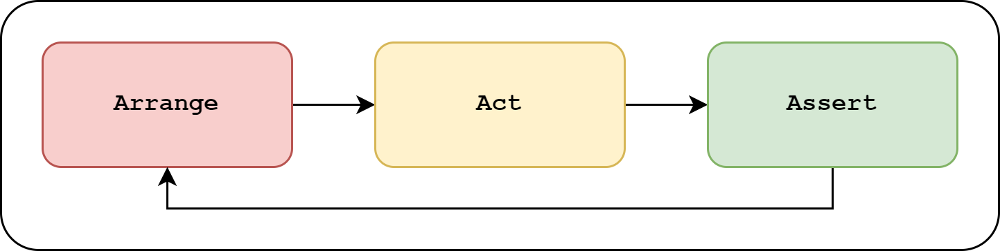
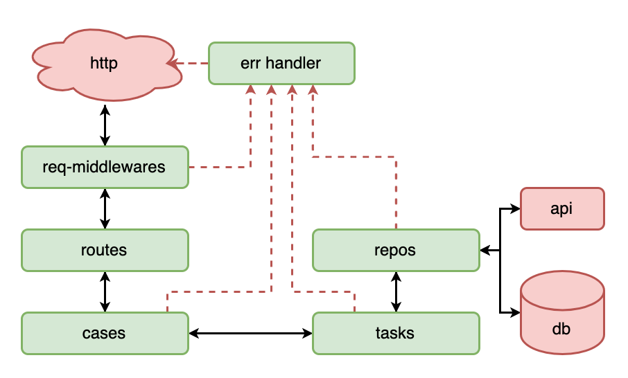
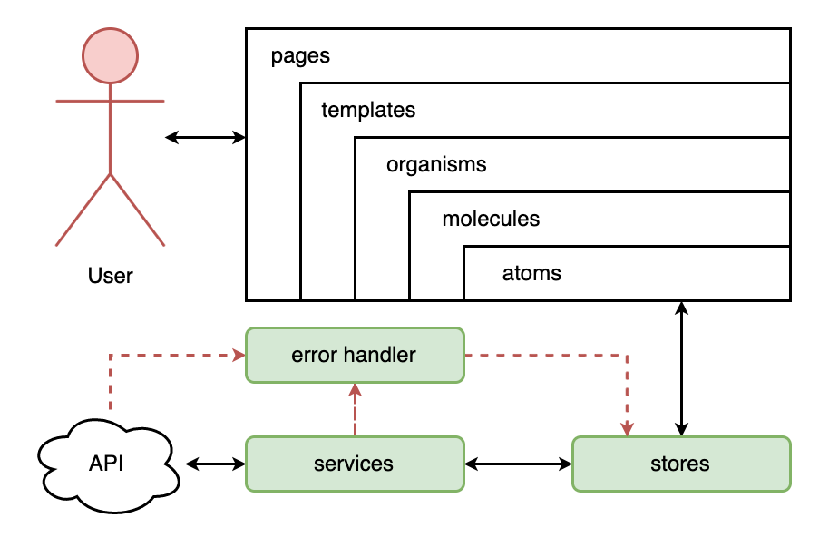
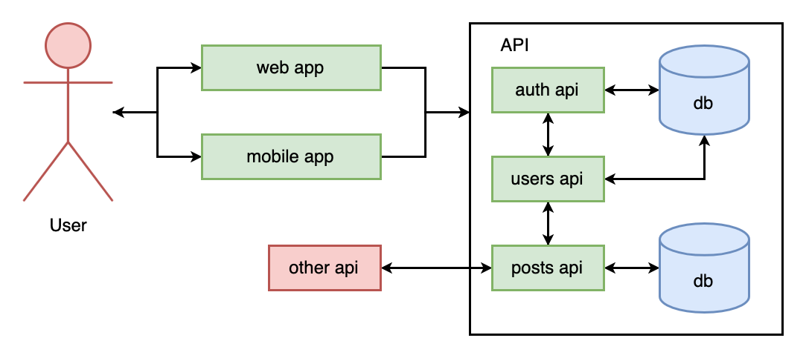

### **🚀 From Zero to Hero 🚀**

#### Testes no Backend

---

### **O que são testes?**


<small>Fluxograma básico do processo ágil.</small>

--

### **O que são testes?**


<small>Antigo processo de desenvolvimento.</small>

--

### **O que são testes?**


<small>Garantia de qualidade e confiabilidade.</small>

---

### **Porque testar?**


<small>_"Queremos o melhor pelo o menor custo!"_</small>

--

### **Porque testar?**


<small>_"Será que o que eu comprei realmente está me atendendo?"_</small>

--

### **Porque testar?**

{width=65%}

<small>Quanto mais rápido identificado o bug, menor preço.</small>

---

### **Quando devo testar**


<small>Todo teste tem seu custo para ser criado.</small>

--

### **Quando devo testar**


<small>Testes devem ser feitos com eficiência, inteligência e coerência.</small>

---

### **O que devo testar?**


<small>Os comportamentos que "aquilo" se propôe a executar!</small>

--

### **O que devo testar?**

<br/>

- **Chamada de função (call)**
- **Cálculos matemáticos (math):**
- **Operadores de condição (condition):**
- **Estrutura de dados (typing):**
- **Interpolação de dados (templating):**

--

#### **Chamada de função (call)**

```js
const repo = {
  async getById(id) {
    /* ... */
  },
};
const task = {
  async getById(id) {
    const result = await repo.getById(id);
    if (!result) throw new Error("Not found");
    return result;
  },
};
```

--

#### **Cálculos matemáticos (math):**

```js
const task = {
  async checkIsAdult(birthDate) {
    const diff = new Date(Date.now() - birthDate.getTime());
    const year = diff.getUTCFullYear();
    const age = Math.abs(year - 1970);
    return age;
  },
};
```

--

#### **Operadores de condição (condition):**

```js
const task = {
  async checkIMC(value) {
    if (value < 18.5) return "Under weight";
    if (value < 25) return "Normal";
    if (value < 30) return "Over weight";
    if (value < 35) return "Obese I";
    if (value < 40) return "Obese II";
    return "Obese III";
  },
};
```

--

#### **Estrutura de dados (typing):**

```js
const mysql = require("mysql2/promise");
const db = mysql.createPool({ uri: "mysql://" });
const repo = {
  async getById(id) {
    const sql = "SELECT * FROM table WHERE id = ?";
    const [[row]] = await db.query(sql, [id]);
    return row;
  },
};
```

--

#### **Interpolação de dados (templating):**

```js
const task = {
  buildRecoveryEmailTemplate(email) {
    const link = "http://domain.com/recovery?email=" + email;
    let tmpl = "<html><head></head><body>";
    tmpl += '<a href="' + link + '" target="_blank">';
    tmpl += "Click here</a>";
    tmpl += "</body></html>";
    return tmpl;
  },
};
```

---

### **Como devo testar?**

{width=30%}

<small>_"Mas eu nem sei testar ainda..."_</small>

--

### **Como devo testar?**



<small>O Padrão Triple A - Simples!</small>

---

### **Principais tipos de testes**

- Unitários
- Integração
- Ponta-à-ponta
- Manuais

--

### **Outros tipos de testes**

- Resiliência
- Sobrecarga
- Segurança
- UI/UX

--

### **Testes unitários**

```js
const task = {
  async validateToken(token) { /* throws if invalid */ },
  async checkEmailInUse(email) { /* throws if in use */ },
  async addUser(data) { /* throws if invalid */ },
  async getUser(id) { /* throws if not found */ },
};
const case = {
  async addUser(token, data) {
    await task.validateToken(token)        // throws | ok
    await task.checkEmailInUse(data.email) // throws | ok
    const id = await task.addUser(data)    // throws | ok
    const user = await task.getUser(id)    // throws | ok
    return user                               // ok
  },
};
```

--

### **Testes de integração (backend)**

{width=60%}

<small>(fluxo comum de uma api express)</small>

--

### **Testes de integração (frontend)**

{width=60%}

<small>(fluxo comum usando atomic design)</small>

--

### **Testes de ponta-à-ponta**

{width=60%}

<small>(exemplo de fluxo uma solução completa)</small>
