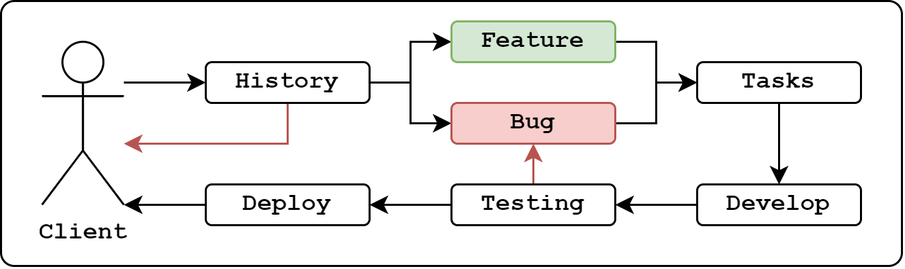
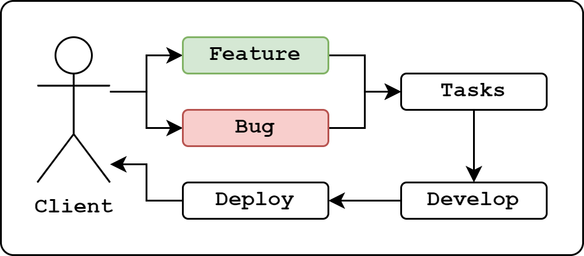
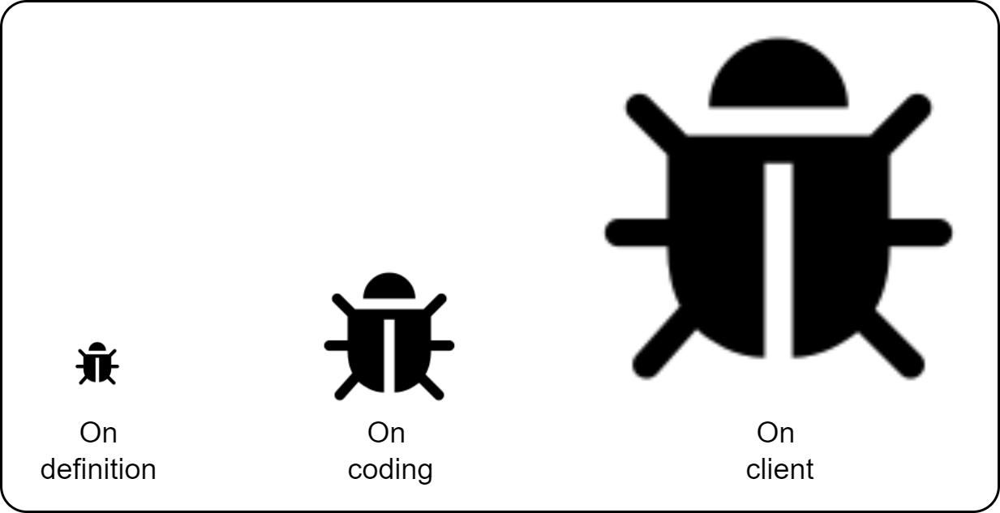
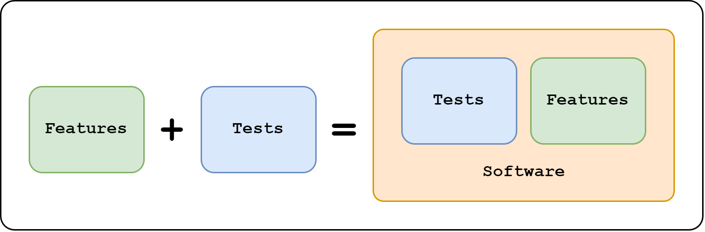

### **🚀 From Zero to Hero 🚀**
#### Testes no Backend


---

### **O que são testes?**



<small>Fluxograma básico do processo ágil.</small>

--

### **O que são testes?**



<small>Antigo processo de desenvolvimento.</small>

--

### **O que são testes?**


<small>Garantia de qualidade e confiabilidade.</small>

---

### **Porque testar?**


<small>_"Queremos o melhor pelo o menor custo!"_</small>

--

### **Porque testar?**


<small>_"Será que o que eu comprei realmente está me atendendo?"_</small>

--

### **Porque testar?**

{width=65%}

<small>Quanto mais rápido identificado o bug, menor preço.</small>

---

### **Quando devo testar**


<small>Todo teste tem seu custo para ser criado.</small>

--

### **Quando devo testar**



<small>Testes devem ser feitos com eficiência, inteligência e coerência.</small>

---

### **O que devo testar?**


<small>Os comportamentos que "aquilo" se propôe a executar!</small>

--

### **O que devo testar?**

<br/>

- **Chamada de função (call)**
- **Cálculos matemáticos (math):**
- **Operadores de condição (condition):**
- **Estrutura de dados (typing):**
- **Interpolação de dados (templating):**

--

#### **Chamada de função (call)**

```js
const model = {
  async getById(id) { /* ... */ }
}
const service = {
  async getById(id) {
    const result = await model.getById(id);
    if(!result) throw new Error('not found');
    return result;
  }
}
```

--

####  **Cálculos matemáticos (math):**

```js
const service = {
  async checkIsAdult(birthDate) {
    const diff = new Date(Date.now() - birthDate.getTime());
    const year = diff.getUTCFullYear();
    const age = Math.abs(year - 1970);
    return age;
  }
}
```

--

####  **Operadores de condição (condition):**

```js
const service = {
  async checkImc(value) {
    if(value < 18.5) return 'Under weight';
    if(value < 25) return 'Normal';
    if(value < 30) return 'Over weight';
    if(value < 35) return 'Obese I';
    if(value < 40) return 'Obese II';
    return 'Obese III';
  }
}
```

--

####  **Estrutura de dados (typing):**

```js
const connection = require('./connection'); // using mysql
const model = {
  async getById(id) {
    const sql = 'SELECT * FROM table WHERE id = ?';
    const [[row]] = await connection.query(sql, [id]);
    return row;
  }
}
```

--

####  **Interpolação de dados (templating):**

```js
const service = {
  buildRecoveryEmail(email) {
    const link = `http://domain.com/recovery?email=${email}`
    const template = `
      <html><head></head><body>
        <p>Click <a href="${link}" target="_blank">here</a> 
        to recover</p>
      </body></html>
    `
    return template
  }
}
```

---
